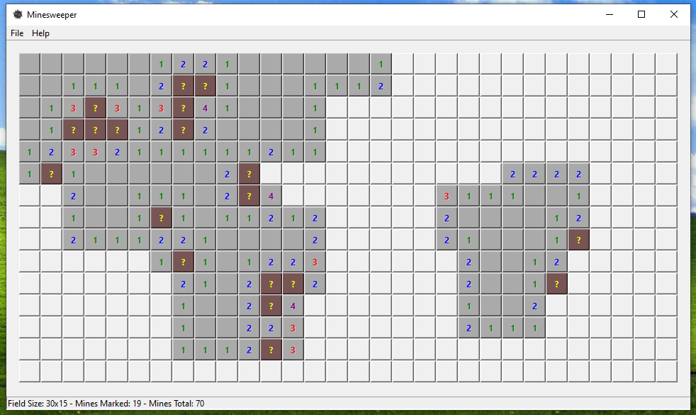

# Minesweeper (Qt 6)

This is a simple implementation of a Minesweeper game, made with C++ using Qt 6 framework. 
Made as an exercise while learning Qt.

The source code is published under GPLv3, the license is available [here](LICENSE.md).

## Supported systems

The project built and tested on a PC, running Windows 10 x64. The code should run on Linux or Mac OS X 
without problems, but this may require additional setup and troubleshooting.

## Third-party

The project uses [Qt 6](https://www.qt.io/) framework, available under [LGPL](http://doc.qt.io/qt-6/lgpl.html). 

## Build instructions

You must have Qt 6 installed in order to be able to build this project. You may need to provide a correct path 
to Qt 6 bundled build system. Refer to CMakeLists.txt in project root, line 9. As an option, you can copy 
`main.php` and `src/` directory contents inside already configured Qt 6 project (e.g. into Qt Creator IDE).

The project is developed inside CLion IDE, using MinGW libraries. However, you should be able to build it with 
any CMake-compatible tool, with minimum setup changes. 

Built executable and libraries are put inside `bin` directory. You may need to copy some additional .dll 
libraries there for the executable to run successfully on Windows. You can copy them from your compiler's 
directory (e.g. `C:\Program Files\JetBrains\CLion <version>\bin\mingw\bin` for CLion project setup).
